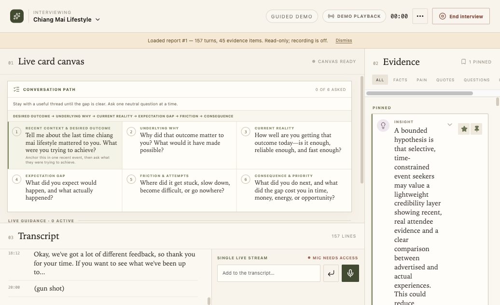
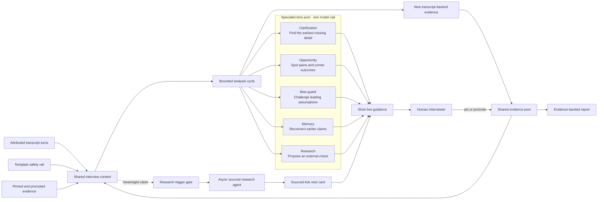
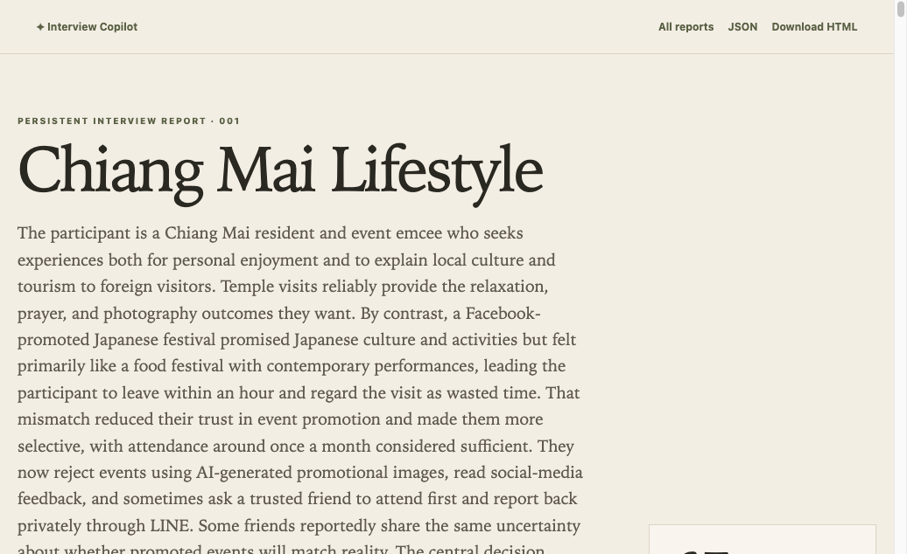

# Interview Copilot

**A local-first research partner that turns a live interview into an evidence base while it is
still happening** — surfacing the next useful question, the bias you are about to walk into, and
the claim worth checking, without joining the conversation.

Built at the **Hacker Fund hackathon, Chiang Mai, August 2026**.

## See it

Two live snapshots from a real 20-minute interview — 157 transcript turns, 45 evidence items,
no hand-editing:

| | |
|---|---|
| 🎛️ **[The workspace](https://claude.ai/code/artifact/f713482e-164b-4e16-a7fa-7771aa2ad4ea)** | What the interviewer sees. Conversation path, live transcript, evidence pool, and the five agent lenses surfacing guidance |
| 📄 **[The report it produced](https://claude.ai/code/artifact/97b27347-2995-4725-ae67-7fbf7c90f167)** | What comes out. Pains, facts, verbatim quotes, unanswered questions, a labelled hypothesis and one validation test |

[](https://claude.ai/code/artifact/f713482e-164b-4e16-a7fa-7771aa2ad4ea)

> [!NOTE]
> The snapshots are static. To run the real thing, see [Run locally](#run-locally) — two commands.

### What a real run looked like

| | |
|---|---|
| Interview | 20 minutes · 157 turns |
| Evidence extracted | 45 items — facts, pains, quotes, workflows, tools |
| Report | 10 pain points · 24 key facts · 10 quotes · 12 unanswered questions |
| Coverage | 4 of 6 criteria met — **the app marked its own interview incomplete** |

That last row is the design working. The report scores the *interview*, not itself, and says
plainly what was never established.

## The problem

Customer interviews are deceptively difficult. An interviewer has to listen,
notice missing detail, avoid leading the participant, remember earlier claims,
and decide what to ask next—all at the same time. When that work is weak, teams
leave with thin notes and mistake opinions or proposed solutions for evidence.

Interview Copilot reduces that cognitive load without joining the conversation.
The human remains in charge; the software listens, structures, and suggests.

## MVP scope

The current prototype includes:

- a light, beige, text-centred three-column interview workspace
- an always-on microphone from **Start interview** to **End interview**
- local transcription through `whisper.cpp`, plus typed transcript input
- durable audio chunks plus JSONL and Markdown transcripts under `data/interviews/`
- live evidence extraction for facts, pains, quotes, workflows, tools, questions,
  and insights
- specialist clarification, opportunity, bias, memory, and research lenses
- silent, source-grounded live internet research that turns verifiable claims,
  counterexamples, local constraints, and existing initiatives into a neutral
  **Ask next** card
- a Nimman Mini Hackathon template library for community connection, Chiang Mai
  lifestyle, smart-city, and open problem discovery interviews
- a six-step, topic-aware conversation safety rail available before the first
  participant response, with live agent guidance kept directly below it
- pin, promote, dismiss, filter, confidence, and provenance controls
- a durable, incrementally numbered report library at `/reports`, with complete
  standalone HTML/JSON snapshots, the full transcript, evidence ledger, coverage,
  and Markdown copy/export
- a deterministic guided demo and graceful local fallback
- responsive desktop and mobile layouts

Deliberate MVP boundaries:

- sessions and completed reports are archived to disk; browser storage keeps the active UI state
- live research is intentionally sparse: it searches only after a gated claim,
  returns at most two cards, and returns nothing when source support is weak
- microphone segments use the selected speaker; diarisation is out of scope
- the lenses share one bounded model call per analysis cycle to control latency
  and cost

## Method

The central design idea is a **shared evidence pool**. Agents do not pass private
messages to one another or independently reinterpret the full conversation.
They read and write the same structured objects.

### Shared evidence and specialist pool

The specialist agents are logical lenses inside one bounded analysis call, not
five independent model processes. A separate asynchronous research lane reads
the same interview state without blocking capture or normal analysis.



### Always-on microphone feedback loop

Each answer creates a tighter next question. The copilot prioritizes the
earliest important unknown in the active thread, while the interviewer remains
free to ignore the suggestion and follow the participant's words.

```mermaid
flowchart LR
    participant["Participant speaks"] --> mic["Always-on microphone"]
    mic --> chunks["Overlapping audio segments"]
    chunks --> archive["Durable local audio archive"]
    archive --> whisper["Local Whisper transcription"]
    whisper --> turn["New attributed transcript turn"]

    turn --> poolState["Transcript + shared evidence + interview objective"]
    poolState --> analysis["Specialist lens pool"]
    poolState -.->|gated and debounced| research["Async live research"]

    analysis --> focus["Highest-value unresolved detail"]
    research --> focus
    focus --> ask["One neutral Ask next question"]
    ask --> human["Interviewer listens and chooses"]
    human --> question["Focused follow-up"]
    question --> participant

    turn --> evidenceUpdate["Extract facts, pains, quotes, workflows and tools"]
    evidenceUpdate --> poolState
```



This keeps the system extensible and makes its reasoning visible in the UI.
Transcript statements remain the source of truth. Suggestions are labelled as
agent material, confidence describes extraction certainty rather than objective
truth, and external claims require a real source.

## Interview template library

The setup screen includes four behavior-based starting points:

| Template | Track | Research focus |
|-|-|-|
| Digital Nomads & Chiang Mai | Community & belonging | When local–remote worker connections become meaningful |
| Chiang Mai Lifestyle | Lifestyle & access | How wellness, culture, and community become accessible or exclusionary |
| Smart & Livable City | Urban intelligence | A recurring city decision improved by better information or coordination |
| Open Problem Discovery | Open local discovery | Any locally relevant problem, without steering toward a proposed solution |

Each selection replaces the objective, six conversation phases, starter
questions, success signals, and interviewer guidance as one unit. The path is a
safety rail rather than a survey: ask naturally, then follow the participant's
words. Editing the topic or objective changes the interview to a custom template
and generates a neutral, behavior-based path locally—no model or network call is
needed.

Browser storage persists built-in templates by stable ID. On reload, the app
combines that ID with the newest built-in content, so an older saved template
cannot overwrite updated phases or success signals. Legacy template-only saves
are migrated; missing guidance fields receive safe defaults.

## Architecture

- **Frontend:** React 19, TypeScript, Vite
- **Local API:** FastAPI and Pydantic
- **Speech-to-text:** `ffmpeg` + local `whisper.cpp`
- **Model runtime:** OpenCode sidecar using the user's existing OpenAI OAuth
  session; the default model is `openai/gpt-5.6-sol`
- **Web retrieval:** OpenCode's supported Exa MCP search endpoint, used without
  a new API key; retrieved excerpts are validated before the OAuth model may
  turn them into a question
- **Fallback:** deterministic local extraction and reporting if the model runtime
  is unavailable

Audio is segmented in the browser and transcribed on the local machine. OAuth
credentials are inherited by the local OpenCode process; no token is copied into
this repository or exposed to the browser.

### Silent live research

The research lane is separate from transcription and normal evidence extraction.
The browser debounces meaningful state changes and cancels stale requests; the
server applies a per-interview cooldown, query cache, URL deduplication, semantic
deduplication, and revision checks. Mundane transcript chunks never reach the
search provider. A search is allowed only for a universal/absence claim, named
initiative, current or location-dependent claim, proposed solution, local
constraint, partner/dataset/API/pilot feasibility question, or missing
stakeholder perspective.

Retrieval and reasoning are deliberately split. The Exa MCP response supplies
source titles, direct URLs, dates, and excerpts. The OpenCode/OpenAI OAuth model
may reason only over those retrieved documents and must return an exact supporting
excerpt. The server rejects invented URLs, excerpts absent from the linked source,
weak-confidence drafts, leading questions, unsourced cards, and duplicate results.
Pinned cards become `source="web"` evidence and retain the source URL plus their
complete research provenance.

Tradeoff: OpenCode's current keyless web-search path is backed by the external
Exa service, so a triggered search query is sent to Exa and the retrieved public
source text is sent to the authenticated OpenAI model. The direct OpenAI Responses
web-search API was not used because the existing OpenAI OAuth session does not
provide API-key authentication for that endpoint. Set
`INTERVIEW_RESEARCH_ENABLED=0` for a fully offline interview; the lane then
silently returns no cards and all recording, transcription, and guidance continue.

By default, every microphone segment is fsynced to disk before Whisper runs. Its
result is then appended to both `transcript.jsonl` and `transcript.md` in a
unique session directory under `data/interviews/`. Failed transcriptions retain
their original audio and receive an error entry, so a decoder or model failure
cannot erase the conversation. Raw-audio persistence can be disabled while
keeping the transcript ledger. This private archive is excluded from Git.

More detail is available in [the MVP contract](docs/MVP.md).

## The evidence rules

The rules that make a report trustworthy, and the reason the output reads as research rather
than as a summary:

- The **transcript is the source of truth**.
- **Agent suggestions are not facts until pinned** — and stay labelled as agent material after
  pinning.
- **External claims require a real URL.** With no web retrieval, the research lens proposes a
  search rather than fabricating a result.
- **Confidence communicates extraction certainty**, not objective truth.
- Promoted evidence enters the next model context first; dismissed suggestions disappear.

[](https://claude.ai/code/artifact/97b27347-2995-4725-ae67-7fbf7c90f167)

## Run locally

Prerequisites:

- Node.js 20+
- Python 3.11+ and [`uv`](https://docs.astral.sh/uv/)
- `ffmpeg`
- [`whisper.cpp`](https://github.com/ggml-org/whisper.cpp) with `whisper-cli`
  and a local GGML model
- [OpenCode](https://opencode.ai/) signed in with OpenAI OAuth for live analysis
- network access to the configured search endpoint for live research (optional)

Install dependencies and start the development servers:

```bash
make install
make dev
```

Open [http://localhost:5173](http://localhost:5173). The frontend proxies API
requests to the FastAPI server on port `8787`.

For a production-style local build:

```bash
make build
make start
```

Then open [http://localhost:8787](http://localhost:8787).

If Whisper or OpenCode is unavailable, the app remains usable with typed input,
local extraction, and the guided demo.

## Configuration

The setup screen's **Advanced configuration** dialog exposes the complete
versioned interview configuration in form and YAML views. A validated snapshot
is frozen into the durable archive when an interview starts.

The canonical application preset is
[`config/presets/digital-nomad-discovery.yaml`](config/presets/digital-nomad-discovery.yaml).
The API loads and validates that file; the frontend does not carry a second copy
of prompt, model, audio, or limit defaults. Advanced configuration supports:

- editable, reorderable phases, success metrics, and interviewer guidance;
- complete analysis/report prompts, specialist lens and report-section switches;
- transcript/evidence/output limits, capture timing, speaker, model, and archive settings;
- synchronized Form/YAML editing with `.yaml`/`.yml` import and full export;
- backend-authoritative validation, dirty-state reporting, cancel/apply, and reset
  to the selected preset.

Whisper model and language edits are marked as requiring a local service
restart. All other supported runtime controls apply to the next interview. The
browser deep-copies the validated configuration at Start, and sends the same
frozen object to analysis, reporting, audio capture, and the archive start API.

Each session directory contains `session.json`, `configuration.yaml`,
`transcript.jsonl`, `transcript.md`, and—when enabled—`audio/`. The configuration
snapshot is written before microphone permission is requested, so later setup
edits cannot change an active or archived interview.

Completed reports receive monotonic ids and are frozen under
`data/interviews/reports/NNNNNN/` as both `report.json` and a self-contained,
print-friendly `report.html`. The same snapshots remain available from the local
app at `/api/reports/{id}` and `/reports/{id}` after a restart; `/reports` lists
the complete report history.

| Variable | Default | Purpose |
|-|-|-|
| `INTERVIEW_MODEL` | `openai/gpt-5.6-sol` | OpenCode provider/model |
| `OPENCODE_BIN` | auto-discovered | OpenCode executable |
| `OPENCODE_PORT` | `4097` | Local sidecar port |
| `OPENCODE_URL` | unset | Reuse an already-running sidecar |
| `INTERVIEW_RESEARCH_ENABLED` | `1` | Set to `0` to disable all external research |
| `INTERVIEW_RESEARCH_SEARCH_URL` | `https://mcp.exa.ai/mcp` | Streamable-HTTP MCP search endpoint |
| `WHISPER_BIN` | auto-discovered | `whisper-cli` executable |
| `WHISPER_MODEL` | auto-discovered | Path to a local GGML model |
| `WHISPER_LANGUAGE` | `auto` | Whisper language |

Model discovery checks `~/.cache/whisper/ggml-small.en.bin`, then
`~/.cache/whisper/ggml-base.en.bin`, then Homebrew's tiny test model. Set
`WHISPER_MODEL` explicitly to use another model.

## Development

```bash
make test          # backend plus frontend component/unit tests
make build         # frontend typecheck and production build
make check         # tests + frontend build
```

Generated files, local models, OAuth state, logs, virtual environments, and
frontend dependencies are excluded from Git.
